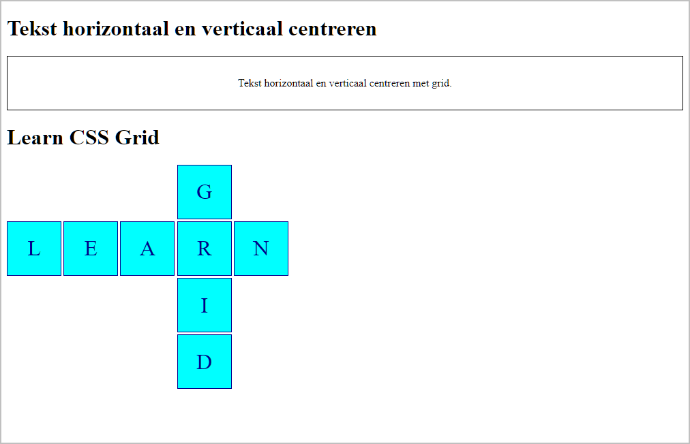

# Les 9 - Starter oefeningen H10 - Lay-out in een raster - Grid

Download of clone deze repository.

De Developer Tools van de browser Mozilla Firefox zijn handiger om te werken met Grid Layout en Flexbox Layout dan de Developer Tools van Google Chrome. Gebruik dus voor deze oefeningen Mozilla Firefox in plaats van Google Chrome.

## Oefening 1 - Grid Layout CodePens

Bekijk telkens onderstaande CodePens en voer de opdracht uit die eronder vermeld staat. Experimenteer gerust ook zelf door nog andere wijzigingen aan te brengen. 

- [CodePen - Grid 01: grid container](https://codepen.io/plauwaer/pen/KOvGYq)
  
  Pas de CodePen aan zodat je het onderstaande raster bekomt:

  

- [CodePen - Grid 02: fr-eenheid](https://codepen.io/plauwaer/pen/ymzzjg)

  Pas de CodePen aan zodat de tweede en de derde kolom steeds even breed zijn:

  

- [CodePen - Grid-03: repeat()](https://codepen.io/plauwaer/pen/LYZXEpE)

  - Wijzig het raster van 4 kolommen naar 9 kolommen van gelijke breedte. 
    Merk op dat de laatste vier kolommen leeg blijven.
  
- [CodePen - Grid-04: repeat()](https://codepen.io/plauwaer/pen/yLJQeBq)

  - Wijzig de 5 kolommen in 7 kolommen: 100px 1fr 2fr 1fr 2fr 1fr 2fr, waarbij je, waar mogelijk, de `repeat()` CSS function gebruikt.

- [CodePen - Grid-05: grid lines](https://codepen.io/plauwaer/pen/dyXQPNM)

  Open de CodePen en gebruik de Firefox Grid Inspector om de lijnnummers weer te geven van het element `div.grid-container`. Merk op dat de Grid Inspector zowel de positieve als de negatieve lijnnummers weergeeft.

  

- [CodePen - Grid-06: position grid items with grid lines](https://codepen.io/plauwaer/pen/ZEOmYjg)

  Herwerk deze CodePen tot je het onderstaande bekomt. 

  

- [CodePen - Grid-07: position grid items with grid-column en grid-row](https://codepen.io/plauwaer/pen/MWezYVR)

  Deze CodePen definieert hetzelfde raster als de vorige CodePen, maar de code is korter omdat we gebruikmaken van de shorthand properties `grid-row` en `grid-column` en van het feit dat er standaard één kolom of één rij overspannen wordt, zodat in het bovenstaande raster op verschillende plaatsen het kolom-einde of het rij-einde overbodig is.

  Maak terug het bovenstaande raster en maak deze keer gebruik van de shorthand properties `grid-row` en `grid-column`. Dit zou nu een stuk vlotter moeten gaan.

  Gebruik ook eens een negatief lijnnummer bijv. bij .box4.

- [CodePen - Grid-08: position grid items with grid-column, grid-row en span](https://codepen.io/plauwaer/pen/vYKQEQJ)

  Deze CodePen definieert terug hetzelfde raster als de vorige CodePen, maar deze keer wordt bijkomend gebruikgemaakt van `span`.
  Met deze notatie kan je eventueel ook de kolommen tellen in plaats van de lijnen. Voorbeeld: .box4 begint in kolom 2 en overspant 2 kolommen `grid-column: 2 / span 2`;

  Maak opnieuw het bovenstaande raster gebruikmakend van `grid-column`, `grid-row` en `span`. 

- [CodePen - Grid-09: grid-template-areas](https://codepen.io/plauwaer/pen/VwjVLay)

  Deze keer is het raster gemaakt met behulp van `grid-template-areas`.

  Herwerkt voor de laatste keer het raster naar het bovenstaande raster (zie grid-06). Je zal merken dat het met `grid-template-areas` nog een stuk vlotter gaat.

## Oefening 2 - Basis Grid Layout

- Open de map **oefening2** in Visual Studio Code.
  
- Herwerk de webpagina totdat je de onderstaande layout bekomt. Hoe breed elke box moet zijn kan je aflezen in onderstaande schermafbeelding. Probeer zelf deze layout te maken of volg onderstaande stapsgewijze procedure.

  
  
  Stapsgewijze procedure:
  - Definieer een raster met 4 kolommen van elk 150 pixels breed. 
    Tip Plaats eerst rond de div-elementen een container-element, bijv. een div-element met class grid-container.
  - Maak vervolgens gebruik van `grid-row` en `grid-column` om de grid-items te positioneren op het raster.
  
## Oefening 3 - Holy Grail

De bedoeling van deze oefening is een responsive webpagina te maken waarbij je de holly_grail layout implementeert met behulp van CSS Grid.

Vooraleer je deze oefening maakt moet je eerst het volgende Wikipedia-artikel lezen: [https://en.wikipedia.org/wiki/Holy_grail_(web_design)](https://en.wikipedia.org/wiki/Holy_grail_(web_design)).

Open nu de map **holly_grail** in Visual Studio Code.

Deze bevat al de html en ook de CSS voor de weergave op de smartphone. Voeg nu nog zelf de CSS toe om de holy_grail layout te maken vanaf een viewport van 700 pixels. De eerste en de laatste kolom geef je vaste breedtes. De eerste kolom maak je ongeveer 20 karakters breed en de laatste kolom ongeveer 15 karakters. De middelste kolom krijgt alle overige ruimte.

Zorg er tevens voor dat de container niet breder wordt dan 960 pixels.

## Oefening 4 - Basis Grid Layout

- Open de map **oefening4** in Visual Studio Code.

- Herwerk de webpagina totdat je de onderstaande layout bekomt. Probeer zelf deze layout te maken of volg onderstaande stapsgewijze procedure.

  

  Stapsgewijze procedure:
  - Maak 'grid containers' van de elementen met `class="grid-container"`, zodat alle p-elementen grid items worden.
  
    Merk op dat de marges van de p-elementen nu niet meer worden samengevoegd (geen 'margin collapse').*

  - Verwijder de marges van alle p-elementen.
  - Plaats in beide 'grid containers' de zes p-elementen in een raster van 2 rijen en 3 (gelijke) kolommen. 

- Pas de webpagina verder aan totdat je de onderstaande layout bekomt. Probeer zelf de layout aan te passen of lees de tip onder de schermafbeelding.

  

  Tip Om de grid items uit te lijnen kan je gebruikmaken van de CSS properties: justify-items, align-items, justify-self en align-self.

## Oefening 5 - Learn Grid

Open de map **learn_grid** met startbestanden in Visual Studio Code.

Om tekst zowel horizontaal als verticaal te centreren kan je CSS Grid gebruiken. Dit wordt gedemonstreerd in de startbestanden . Het is hierbij niet nodig om de tekst in een ``-element of een `
`-element te stoppen. Dit komt omdat "each contiguous run of text that is directly contained inside a *grid container* is wrapped in an anonymous *grid item*", bron : [CSS Grid Layout Module Level 1](https://www.w3.org/TR/css-grid-1/#grid-items).

Breid de webpagina uit met onderstaand diagram LEARN GRID.

Maak hierbij gebruik van Grid Layout en positioneer de vierkanten op de grid met behulp van lijnnummers.

Opmaak vierkanten:

-	de zijden van de vierkanten zijn 5 rem groot;
-	tussen de vierkanten is er een witruimte van 0,2 rem;
-	de lettergrootte is 2 rem en de letterkleur is 'darkblue';
-	de achtergrondkleur van de vierkanten is 'cyan';
-	de rand is 1 pixel breed en de kleur is 'darkblue'.
-	de letter in het vierkant is zowel horizontaal als verticaal gecentreerd.

Er zijn verschillende werkwijzen mogelijk om onderstaand diagram te bekomen. Wellicht is het, het eenvoudigst om elk vierkant (letter) van een classname (of id) te voorzien - bijv. .box1, .box2, - en vervolgens elk vierkant expliciet te positioneren op de grid. Maak voor het positioneren van de grid items bijvoorbeeld gebruik van de CSS properties `grid-column` en `grid-row`.

Te bekomen resultaat:

## Oefening 6 - Grid template areas

Maak een kopie van je oplossing van voorgaande oefening en noem deze **learn_grid_template_areas** en pas de oefening aan waarbij je gebruikmaakt van de `grid-template-areas`-property. Het is dus de bedoeling om deze keer geen lijnnummers te gebruiken.

## Oefening 7 - Graphics Design

Open de map **graphics_design** met startbestanden in Visual Studio Code.

Veronderstel dat je onderstaande layout van een Graphics Designer krijgt en je deze moet namaken in een webpagina. 
En dat je bovendien de layout ook een beetje responsive moet maken, zie onderstaande animated GIF. 

Je beslist om hiervoor gebruik te maken van CSS Grid Layout. Hoeveel grid kolommen ga je dan gebruiken? Voor de witruimte rond de layout gaan we marges van 2.5rem gebruiken, hiervoor moet je geen kolommen voorzien. 

[Mogelijke oplossing](images/graphics_design_grid_inspector.png)

Implementeer de grid en maak bij het definiëren van de grid zoveel als mogelijk gebruik van `span` in plaats van een end row line/ end column line op te geven.

Extra info:
- De eerste en de laatste kolom hebben beiden een breedte van 100 pixels.
- De foto is 400 pixels breed.
- De witruimte tussen twee paragrafen moet behouden blijven op 1em en mag niet verdubbelen.

&nbsp;&nbsp;

## Oefening 8 - 12-column Grid System

Open de map **12-column-grid-system** met startbestanden in Visual Studio Code.

In deze oefening moet je een 12-column-grid-system gebruiken om een responsive design te maken voor een reeks afbeeldingen. Op een smartphone moeten alle foto's onder elkaar getoond worden en hoe wijder de viewport wordt, hoe meer foto's er naast elkaar moeten getoond worden. Eerst twee foto's naast elkaar, dan drie en maximaal vier foto's naast elkaar.

Graphic Designers werken dikwijls met een Grid System van 12 kolommen van gelijke breedte. Dit omdat 12 deelbaar is daar verschillende getallen. Ook sommige CSS frameworks, zoals bijv. bootstrap maken gebruik van een 12-column Grid System.

Als we de foto's een minimale breedte van 200 pixels willen geven, dan kunnen we de volgende breakpoints gebruiken:
- 416 pixels ( 2 * 200 pixels + 2 * 8 pixels body margin) voor twee kolommen met foto's
- 616 pixels voor drie kolommen met foto's (zie schermafbeelding)
- 816 pixels voor vier kolommen met foto's

Probeer zelf de layout te maken of volg onderstaande stapsgewijze procedure.

- Plaats rond de img-elementen een container-element, bijv. een div-element met class **fotos**.
- Maak van dit div-element een grid container en definieer 12 kolommen met een breedte van 1fr.
- Maak de img-elementen responsive (max-width: 100%).
- Werk nu van één kolom foto's (Mobile first) naar de vier kolommen met foto's toe. 
  **Tips** Het volstaat om aan te geven hoeveel kolommen een foto moet overspannen en voor de rest het 'grid auto-placement algoritm' zijn werk te laten doen. In het geval van één kolom met foto's moet één foto twaalf kolommen overspannen. Vanaf 416 pixels wensen we twee kolommen met foto's en moet elke foto dus zes kolommen overspannen, enz.

We willen ook rekening houden met ultra-high-definition schermen, dus van zodra de vier foto's hun volle breedte (500 pixels) bereikt hebben moet het div-element met de foto's gecentreerd worden. 

